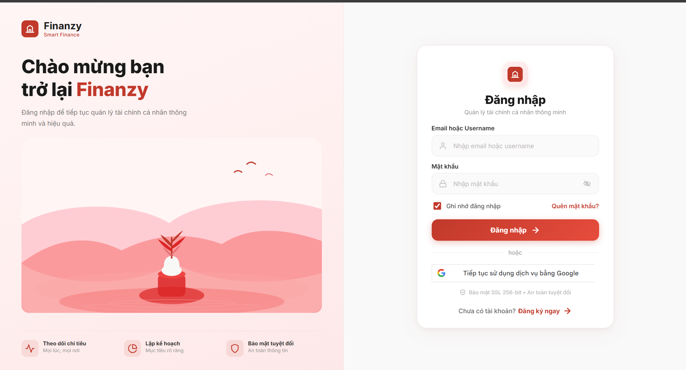

# Cloud Finance Platform (Finanzy)

Nền tảng quản lý tài chính cá nhân sử dụng kiến trúc microservices, hỗ trợ giao dịch, ngân sách, mục tiêu tiết kiệm, hóa đơn, OCR và trợ lý AI tiếng Việt.

[](https://github.com/Tahumn/cloud-finance-platform/actions/workflows/ci.yml)
[](https://github.com/Tahumn/cloud-finance-platform/actions/workflows/deploy-aws.yml)


## Demo

- Website: <https://d29kxn0rxd6abn.cloudfront.net>
- Repository: <https://github.com/Tahumn/cloud-finance-platform>
- Khu vực AWS: `ap-southeast-1` (Singapore)

> Đây là môi trường demo phục vụ đồ án thực tập. Amazon SES có thể vẫn ở Sandbox; khi đó chỉ các địa chỉ email đã xác minh mới nhận được OTP. Có thể sử dụng Google Sign-In để trải nghiệm.

## Tính năng chính

- Đăng ký, đăng nhập JWT/OTP và Google Sign-In.
- Thiết lập hồ sơ lần đầu cho cả tài khoản thường và Google.
- Quản lý thu nhập, chi tiêu, tài khoản, danh mục và nhãn.
- Tạo ngân sách, mục tiêu tiết kiệm và giao dịch định kỳ.
- Chat AI tạo nhiều giao dịch từ một câu tiếng Việt và tự phân loại thu/chi.
- Xác nhận chỉ áp dụng cho thao tác sửa hoặc xóa có rủi ro.
- OCR hóa đơn bằng Tesseract kết hợp Gemini, lưu hóa đơn và giao dịch.
- Báo cáo, dashboard, cảnh báo và thông báo thời gian thực.
- Giao diện responsive cho web và thiết bị di động.

## Kiến trúc

### Các microservice

| Service | Vai trò | Lệnh chạy |
| --- | --- | --- |
| Gateway | Reverse proxy, REST và WebSocket entry point | `app.gateway_main:app` |
| Auth | JWT, OTP, Google Sign-In, onboarding | `app.services.auth_main:app` |
| Finance | Giao dịch, tài khoản, ngân sách và mục tiêu | `app.services.finance_main:app` |
| Notifications | Notification REST API và queue producer | `app.services.notifications_main:app` |
| Notifications Worker | RQ consumer và gửi email | `app.workers.notifications_worker` |
| Planning | Kế hoạch và gợi ý tài chính | `app.services.planning_main:app` |
| Recurring | Giao dịch định kỳ | `app.services.recurring_main:app` |
| OCR | Tesseract, Gemini và xử lý hóa đơn | `app.services.ocr_main:app` |
| AI | Chat, phân tích ý định và báo cáo | `app.services.ai_main:app` |

### Triển khai AWS hiện tại

```text
Users
  -> CloudFront + AWS WAF
      -> S3 (React SPA)
      -> ALB (REST/WebSocket)
          -> Gateway on ECS Fargate
              -> ECS Service Connect / AWS Cloud Map
                  -> Auth, Finance, AI, OCR, Planning,
                     Recurring, Notifications và Worker
                      -> RDS PostgreSQL
                      -> ElastiCache for Redis / RQ
                      -> S3 receipts bucket (integration pending)
                      -> Amazon SES through SMTP/TLS
                      -> Gemini API qua NAT Gateway
```

- Frontend được lưu trong S3 private bucket và phân phối bằng CloudFront OAC.
- ALB chỉ chuyển request đến Gateway trên cổng `8000`.
- ECS tasks chạy trong private application subnets trên hai Availability Zone.
- Service-to-service sử dụng ECS Service Connect và AWS Cloud Map.
- PostgreSQL dùng các logical database riêng theo domain trên một RDS instance dùng chung.
- Redis dùng cho cache, RQ và Pub/Sub; môi trường demo hiện có một primary và chưa bật automatic failover.
- Secrets Manager/KMS quản lý cấu hình nhạy cảm; CloudWatch lưu logs và metrics.
- Môi trường demo hiện ưu tiên chi phí. RDS có thể chạy Single-AZ; production nên dùng Multi-AZ, NAT Gateway theo AZ, autoscaling, backup và deletion protection.

Tài liệu kiến trúc:

- [AWS architecture review](docs/architecture/aws-architecture-review.md)
- [Sơ đồ Draw.io](docs/architecture/aws-production.drawio)

## Công nghệ

| Thành phần | Công nghệ |
| --- | --- |
| Frontend | React 18, Vite, Recharts, Socket.IO Client |
| Backend | Python 3.11, FastAPI, SQLAlchemy, Alembic |
| Database | PostgreSQL / Amazon RDS |
| Cache & Queue | Redis, RQ / Amazon ElastiCache |
| AI | Google Gemini API |
| OCR | Tesseract OCR |
| Auth | JWT, OTP, Google Identity Services |
| Cloud | CloudFront, S3, WAF, ALB, ECS Fargate, ECR, RDS, ElastiCache, SES, Secrets Manager, CloudWatch |
| CI/CD | GitHub Actions, AWS OIDC, Docker, Amazon ECR |

## Chạy local

### Yêu cầu

- Docker Desktop và Docker Compose.
- Hoặc Python 3.11, Node.js 20+, PostgreSQL và Redis nếu chạy thủ công.
- Gemini API key và Google OAuth Client ID cho các tính năng tương ứng.

### Docker Compose

```bash
git clone https://github.com/Tahumn/cloud-finance-platform.git
cd cloud-finance-platform

cp .env.example .env
# Cập nhật các giá trị bắt buộc trong .env.

docker compose --profile micro up -d --build
```

Frontend local: <http://localhost:5173>

Kiểm tra container:

```bash
docker compose ps
docker compose logs -f gateway
```

Dừng môi trường:

```bash
docker compose --profile micro down
```

### Chạy frontend riêng

```bash
cd frontend
npm ci
npm run dev
```

Build production:

```bash
npm run build
```

### Chạy backend test

```bash
python -m venv .venv
# Windows: .venv\Scripts\activate
# Linux/macOS: source .venv/bin/activate

pip install -r requirements.txt
pytest app/tests -q
```

## Biến môi trường

Sao chép `.env.example` thành `.env`. Các nhóm cấu hình quan trọng:

- Database: `AUTH_DB_URL`, `FINANCE_DB_URL`, `NOTIFICATIONS_DB_URL`, `AI_DB_URL`, `PLANNING_DB_URL`, `RECURRING_DB_URL`.
- Security: `SECRET_KEY`, `ALGORITHM`, `ACCESS_TOKEN_EXPIRE_MINUTES`.
- Redis: `REDIS_URL`.
- Gemini: `GEMINI_API_KEY`, `GEMINI_MODEL_NAME`.
- Google Sign-In: `GOOGLE_CLIENT_ID`, `VITE_GOOGLE_CLIENT_ID`.
- Email: `SMTP_HOST`, `SMTP_PORT`, `SMTP_USER`, `SMTP_PASSWORD`, `SMTP_FROM`.

Không commit `.env`, SMTP password, Gemini key, JWT secret hoặc nội dung Secrets Manager lên Git.

## CI/CD

### Continuous Integration

Workflow `.github/workflows/ci.yml` chạy khi push hoặc mở pull request vào `main`:

1. Cài Python 3.11 và backend dependencies.
2. Chạy `pytest app/tests -q` với SQLite in-memory.
3. Cài Node.js 20 và chạy `npm ci`.
4. Build frontend bằng Vite.

### Deploy AWS

Workflow `.github/workflows/deploy-aws.yml` được chạy thủ công bằng `workflow_dispatch`:

1. GitHub Actions nhận AWS credentials tạm thời qua OIDC; không lưu access key dài hạn.
2. Build một backend image theo Git SHA và push lên Amazon ECR.
3. Tạo revision task definition mới với command riêng cho từng microservice.
4. Rolling update chín ECS services và chờ ổn định.
5. Build frontend với production variables.
6. Đồng bộ assets vào S3 và đặt `index.html` không cache.
7. Invalidate CloudFront.

Repository variables cần thiết:

```text
AWS_REGION
AWS_ROLE_ARN
ECR_REPOSITORY
ECS_CLUSTER
FRONTEND_BUCKET
CLOUDFRONT_DISTRIBUTION_ID
VITE_GOOGLE_CLIENT_ID
```

AWS IAM OIDC role phải giới hạn trust policy đúng repository và GitHub Environment `production`.

## Chi phí và vận hành demo

Các tài nguyên thường phát sinh phí khi đang tồn tại hoặc hoạt động:

- NAT Gateway và dữ liệu đi qua NAT.
- Application Load Balancer.
- ECS Fargate tasks.
- RDS PostgreSQL và storage/backup.
- ElastiCache for Redis.
- CloudFront, S3, CloudWatch Logs, Secrets Manager và SES theo mức sử dụng.

Để giảm phí khi không demo, có thể scale ECS services về `0`. NAT Gateway, ALB, RDS và ElastiCache vẫn có thể tiếp tục tính phí; chỉ xóa hoặc dừng khi đã có kế hoạch khôi phục và backup phù hợp. Luôn kiểm tra AWS Budgets và Cost Explorer.

## Bảo mật

- ECS, RDS và Redis không mở trực tiếp ra Internet.
- Security Group chỉ cho phép ALB → ECS `8000`, ECS → RDS `5432`, ECS → Redis `6379` và ECS ↔ ECS `8000`.
- S3 frontend và receipts là private; CloudFront truy cập frontend qua OAC. Bucket receipts đã được tạo nhưng tích hợp upload từ OCR vẫn đang chờ hoàn thiện.
- Secret được inject vào task lúc khởi động từ AWS Secrets Manager.
- Database không có public access; traffic nội bộ dùng private subnet.
- CI/CD sử dụng GitHub OIDC và IAM role có quyền giới hạn.

## Minh họa

| Đăng nhập | Tổng quan |
| --- | --- |
|  |  |

| Giao dịch | OCR hóa đơn |
| --- | --- |
|  |  |


## License

Xem [LICENSE](LICENSE).
